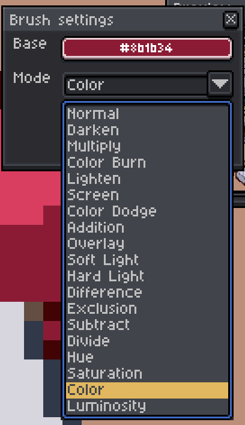

Brush Blending

Aseprite extension for live brush color blending. It samples the color under the cursor and blends it with a chosen base color using common blend modes, then updates the foreground color in real time.

## Features
- Live sampling of the color under the cursor
- Blend with a picked base color
- Multiple blend modes (Normal, Multiply, Screen, Overlay, etc.)
- Foreground color updates in real time

## Installation
1. Copy the extension folder into your Aseprite extensions directory.
2. In Aseprite: `Edit > Preferences > Extensions` and enable it if needed.

## Usage
1. Open **Brush settings** from the Aseprite commands list (`Help > Brush blending`).
2. Pick a **Base Color** with the `Alt + A` command (see shortcuts below).
3. Choose a **Mode** from the dropdown.
4. Click **Start** to enable live blending (button becomes **Stop**).

While enabled, the extension samples the color under the cursor, blends it with the base color, and writes the result to the foreground color.

## Shortcuts
- `Alt + A` - Pick base color under the cursor (Or set custom shortcut for `Brush blending - pick color`)

## Notes
- Blending works on the active sprite under the cursor.
- If the cursor is outside the sprite, the color is not updated.

## License
CC-BY-4.0

## Donate

If you want to support this project, you can send a donation to the address below.

USDT (ERC20 / Ethereum): `0xba47307f0fbc0872d0368b425db52965f1a2eccd`

USDT (Solana / SPL): `9BEWhkbi7odtxC9xdeNHkrh97o4usnF52bPKLJxH3w3D`

USDT (TON): `UQDFqU5LMc9BUQ92fPtPMEv5HU0y1GWDWcSPPhFZb-_IlGLk`
